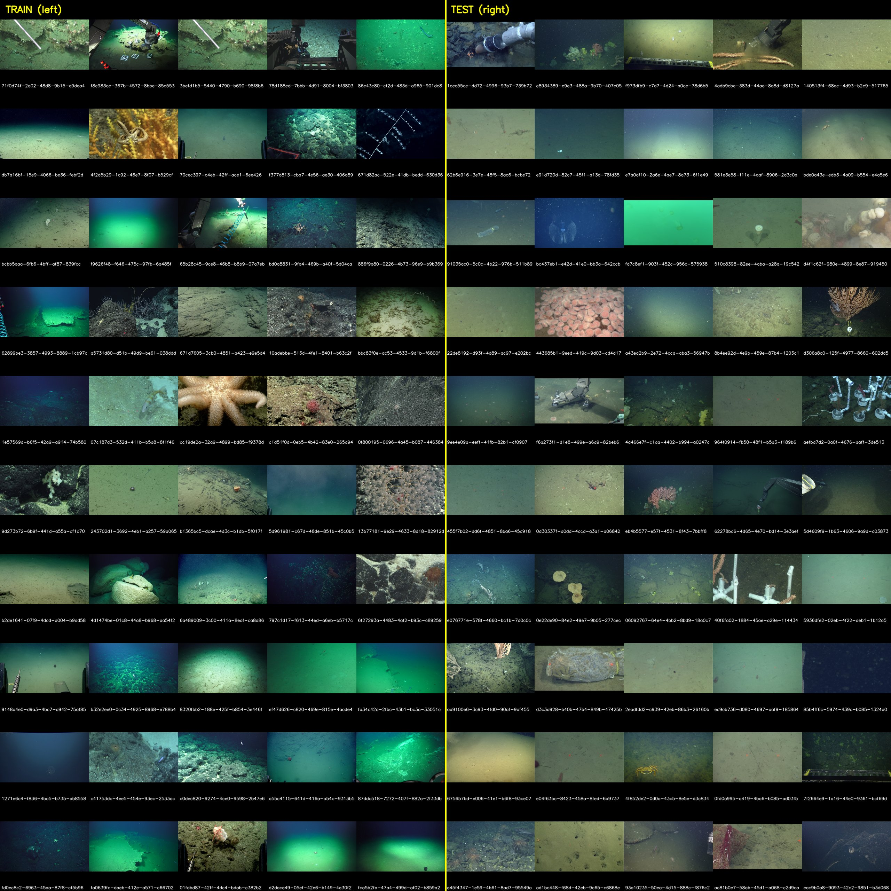
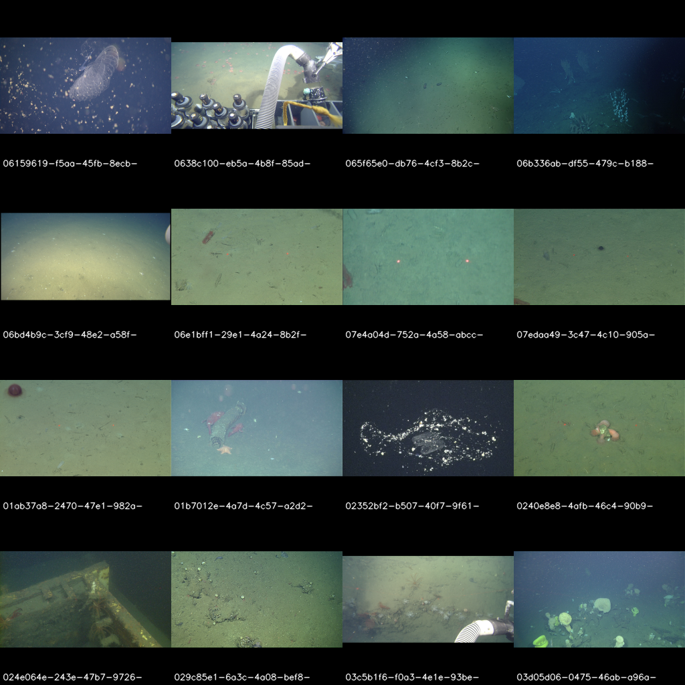

# FathomNet 2026 — Marine Species Detection

**16th on the public leaderboard** of the FathomNet 2026 / CLEF 2026 underwater object detection competition (0.0922 mAP@[.50:.95]).

*Train (left): NOAA + SOI ROV imagery. Test (right): MBARI VARS framegrabs — different institutions, ROVs, oceans, and decades.*

## TL;DR

- **The whole competition is a domain-shift problem.** Train is NOAA + SOI imagery; test is 100% MBARI footage from different subs, oceans, and decades. Your detector has never seen anything like the test set.
- **Making the model "fit better" hurt.** Fancier losses, sampling tricks, pseudo-labels, color correction — all cost leaderboard points.
- **What helped was domain-agnostic:** bigger input resolution, multi-scale test-time inference, and ensembling two architectures.
- **A cautionary tale:** a foundation-model relabeling step looked worth +0.0226 on my offline estimate but did nothing on the real leaderboard. Trust the held-out board, not partial-data estimates.

## Results

| Metric | Value | Notes |
|---|---|---|
| **Public leaderboard rank** | **16th** | FathomNet 2026 / CLEF 2026 |
| **Best leaderboard score** | **0.0922** mAP@[.50:.95] | Best scored submission |
| Best pure detector | 0.0917 | YOLOv8x + RT-DETR-l ensemble |
| Single-model anchor | 0.0863 | YOLOv8x, high-res + multi-scale TTA |
| Private offline estimate | 0.1143 | Composite pipeline on partial data — *did not* hold up on the LB |
| Submissions scored | 28 | 17 during training, 11 post-submission |

## The problem

32 deep-sea species, ~6,500 training images, ~1,400 test images. The catch is where those images come from:

- **Train:** 100% NOAA + SOI — ROVs and cameras from two oceanographic institutions.
- **Test:** 100% MBARI VARS framegrabs — a different institution, different gear, different oceans and decades.
- 14% of test images are 720×486, a resolution that appears **nowhere** in training.

So a model can look near-perfect on held-out training data and still fail on the test set. I saw exactly that: **validation mAP ~0.43, leaderboard mAP ~0.09.** That 8× gap isn't overfitting — it's domain shift.

*Test images: different lighting, gear, resolution, and class mix from training.*

## How I approached it — three phases

### Phase 1 — The obvious things (→ 0.0917)

A solid YOLO model, a good pretrained backbone, multi-scale inference, and an ensemble. Three reliable wins:

- **Higher resolution.** imgsz 640 → 1024: **+0.0137**.
- **Multi-scale test-time inference.** Six scales merged with Weighted Boxes Fusion: **+0.0228** cumulative.
- **Cross-architecture ensemble.** YOLOv8x + RT-DETR-l. RT-DETR-l alone was *worse*, but its errors differed enough to add **+0.0054**.

The single biggest lever was the **MBARI 315k** pretrained checkpoint (trained on related marine imagery), which beat COCO/ImageNet baselines by **+0.078 mAP**.

### Phase 2 — The "improve the model" tricks all backfired

I tried the standard toolkit for **long-tail** (1000× class imbalance) and **domain shift**:

- Rare-class losses (positive-unlabeled, equalized focal, frequency-weighted)
- Oversampling rare classes
- Class-aware copy-paste augmentation
- Pseudo-labeling on confident test predictions
- BatchNorm statistic adaptation
- Underwater color correction at inference

**Every one hurt the leaderboard** — by 1–2 points each. The reason, once it clicked:

> Every losing technique makes the model fit the **training** distribution more tightly. Pseudo-labeling trusts predictions from a model that's never seen MBARI. Loss reweighting and sampling help rare classes *within* training, not across the institutional gap.

Three independent attacks on class imbalance (losses, sampling, augmentation) all hurt. **Class imbalance wasn't the bottleneck — domain shift was.**

### Phase 3 — Optimize the predictions, not the model

With no training-time fix left, I moved to post-processing on the detector's outputs. *The per-step gains below are from a private offline estimate on partial data — see the reality check at the end.*

**1. Two-classifier consensus relabeling** *(offline: +0.0174)*
For each detected box, crop it and run two independent classifiers: a DINOv2 nearest-neighbor lookup against training crops, and a 32-way classifier on the same DINOv2 features. Relabel only when **both** agree the class is wrong. ~3,000 of ~290,000 boxes changed.
*Why it should have worked:* DINOv2 sees MBARI imagery through a broader lens than a NOAA-trained YOLO, so two genuinely different voters can filter mistakes instead of compounding them.

**2. Weighted Boxes Fusion stacking** *(offline: +0.0043)*
Merge two more relabel variants (fine-tuned DINOv2; MLP-only at a higher threshold) with the detector ensemble, weighted winner-heavy.

**3. Letterbox-border noise filter** *(offline: +0.0002)*
The 720×486 images are letterboxed in black bars full of low-confidence false positives. Dropping boxes whose interior mean RGB < 15 removed ~7,000, all scoring < 0.10.

**Reality check.** Offline, this composite pipeline hit **0.1143** (+0.0226 over the pure detector). On the **real leaderboard the gain all but vanished** — the best submission was **0.0922**, barely above the 0.0917 pure detector. Lesson: a partial-data estimate can badly overpromise; only the held-out board tells the truth.

## What didn't work

| Category | Tried | Why it hurt |
|---|---|---|
| Long-tail training | EQLv2, equalized focal loss, repeat-factor sampling, copy-paste | Imbalance isn't the bottleneck; domain shift is |
| Pseudo-labeling | Single- and multi-teacher | Teachers share the NOAA-trained lens — they agree on the wrong things |
| Inference-time domain tricks | BatchNorm adaptation, underwater CLAHE | Train/inference mismatch, or too weak a lever |
| Custom source losses | Positive-unlabeled, federated | Tightens fit to the source domain |
| Aggressive post-processing | Crop-only classifier, retrained SSL, broad relabel thresholds | Conservative + consensus wins; aggressive + greedy loses |

Full numbers for all 28 submissions are in [`notebooks/final_pipeline.ipynb`](notebooks/final_pipeline.ipynb).

## The bigger lesson

**Domain shift was the dominant variable, and the winning techniques were the ones that ignore it.** Higher resolution, multi-scale inference, and cross-architecture ensembling don't "know" anything about NOAA vs MBARI — they just work on images. Everything that assumed train and test share a distribution (loss reweighting, sampling, augmentation, pseudo-labeling) backfired. Good techniques in general; wrong assumption for this competition.

## What I'd do next

- Re-run two blocked experiments — a DANN domain-adversarial run and a hierarchical-classification head (both in `src/`, blocked by a framework regression).
- Add a third ensemble member under the same relabel pipeline.
- SAHI tile-based inference for the small 720×486 letterboxed images.

## Tech stack

PyTorch · Ultralytics YOLO11/YOLOv8 · RT-DETR · DINOv2 (ViT-L/14) · Weighted Boxes Fusion · MBARI 315k weights. Supporting modules (losses, samplers, classifiers, relabel pipeline) live in `src/`.

## Repository

| Path | What's there |
|---|---|
| [`SETUP.md`](SETUP.md) | Install + commands for training, inference, and the notebook |
| [`notebooks/final_pipeline.ipynb`](notebooks/final_pipeline.ipynb) | Results notebook: scoreboard, per-class AP, pipeline diagram (cached outputs) |
| `src/`, `scripts/`, `tests/`, `configs/` | Modules, entry points, unit tests, dataset configs |
| `data/`, `weights/` | Placeholders — see each README for downloads |

## License

Code under Apache 2.0 (see `LICENSE`). Pretrained weights follow their upstream licenses (Ultralytics AGPL-3.0, MBARI 315k CC-BY 4.0).
